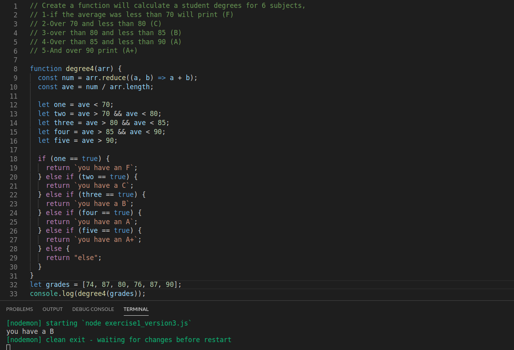

# 3ways_exercise_1



* I created a variable to add up all the marks with reduce:
 ``` const num = arr.reduce((a, b) => a + b);```

* I created another variable that is dividing the amound between the number of marks (6): 
``` const ave = num / arr.length ```

* I put all the possible conditions in variables:
``` let one = ave < 70;
    let two = ave > 70 && ave < 80;
    let three = ave > 80 && ave < 85;
    let four = ave > 85 && ave < 90;
    let five = ave > 90;
```

* I created a set of conditions. If any or the previous variables is true, it will return the final mark
```  if (one == true) {
    return `you have an F`;
  } else if (two == true) {
    return `you have a C`;
  } else if (three == true) {
    return `you have a B`;
  } else if (four == true) {
    return `you have an A`;
  } else if (five == true) {
    return `you have an A+`;
  } else {
    return "else";
  }
```

* console.log function call
``` console.log(degree4(grades)); ```
